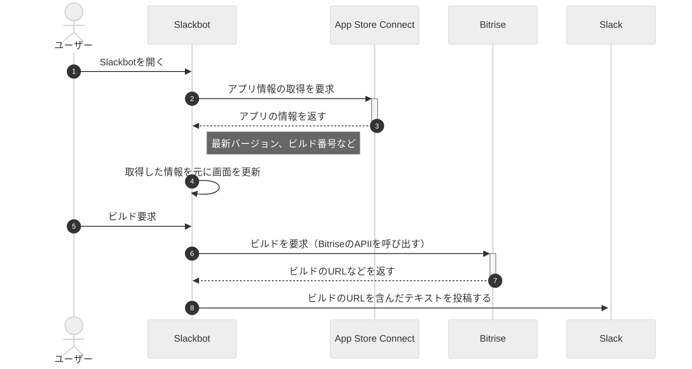

## 環境構築

### グローバルな環境構築

- nodeをインストールする
  - `nodebrew install-binary stable`
- yarnをインストールする
  - `npm install -g yarn`

### プロジェクトの環境構築

- `package.json`の作成
  - `yarn init -y`
- ライブラリのインストール
  - slackアプリを開発するためのパッケージ
    - `yarn add @slack/bolt`
  - TypeScriptで実装するためのパッケージ
    - `yarn add -D typescript @types/node`
  - 環境変数を管理するためのファイルを読み込むためのパッケージ
    - `yarn add dotenv`
  - TypeScripittで実装する時に開発のために必要なパッケージ
    - `yarn add -D eslint eslint-config-prettier eslint-plugin-prettier prettier @types/eslint @typescript-eslint/eslint-plugin @typescript-eslint/parser`
  - TypeScriptで開発中にホットリロードを行うためのパッケージ
    - `yarn add -D tsc-watch`
  - APIリクエストをするためのパッケージ
    - `yarn add axios`

## 開発中のTips

- ファイルの変更を検知してコンパイルと再起動を行う
  - `yarn watch`

## 処理概要

## 参考

- [Macにnodejsを入れたときにFailed to create the fileでインストールできない](https://qiita.com/kz23szk/items/738972e0b6a3ba0783ba)
- [Boltを使ったSlack BotをTypescriptで開発する方法](https://qiita.com/winuim/items/5db662622bbc84ecf92a)
- [Slackアプリ開発の第一歩、スラッシュコマンド「/echo」を利用した簡単なアプリの作り方](https://www.shoeisha.co.jp/book/article/detail/301)